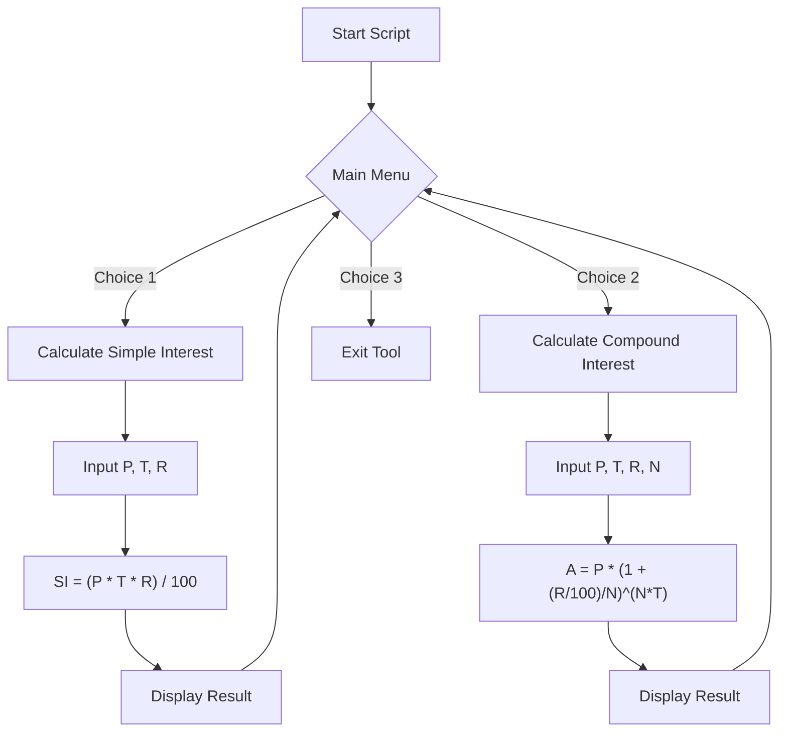

# Technical Specification: Simple and Compound Interest Calculator

## Architectural Overview

The **Simple and Compound Interest Calculator** is a terminal-based financial utility implemented in **Bash Shell Script**. It utilizes standard Unix utilities to provide a menu-driven interface for high-precision financial computations.

### Control Flow Diagram

---

## Technical Implementations

### 1. Calculation Engine: bc (Basic Calculator)
Since standard Shell arithmetic (e.g., `expr` or `$(( ))`) is limited to integer values, this utility leverages the `bc` utility for floating-point precision.

- **Precision Control**: The script utilizes the `scale` variable in `bc` to define the number of decimal places (e.g., `scale=2` for SI, `scale=4` for CI).
- **Process Pipe**: Logic is passed to the engine via stdout piping: `echo "math_logic" | bc`.

### 2. Simple Interest (SI) Logic
The program implements the standard linear growth formula:
- **Formula**: `SI = (Principal * Time * Rate) / 100`
- **Implementation**: The result represents the interest earned over the period `T` at an annual rate `R`.

### 3. Compound Interest (CI) Logic
The program implements the periodic compounding formula to calculate the future value of an investment.
- **Formula**: `Amount (A) = P * (1 + (R/100)/N)^(N*T)`
- **Variables**:
    - `P`: Principal Amount.
    - `R`: Annual Rate of Interest.
    - `T`: Time in years.
    - `N`: Number of compounding periods per year.
- **Exponentiation**: Handled by `bc` using the `^` operator, allowing for complex multi-period growth simulations.

### 4. User Interface Model
The application employs a `while true` loop combined with a `case` statement to create a persistent, interactive terminal environment. Input is gathered asynchronously using the `read` command with prompts.

---

## Technical Prerequisites

- **Shell**: Bash 4.0+
- **Dependency**: `bc` (Standard Unix arbitrary precision calculator utility)
- **Environment**: POSIX-compliant terminal (Linux, Termux, macOS)

---

*Technical Specification | Computer Engineering Project | Version 1.0*
